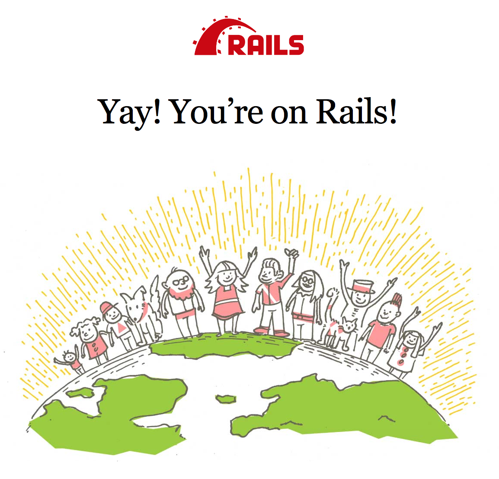
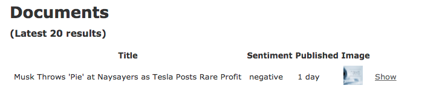
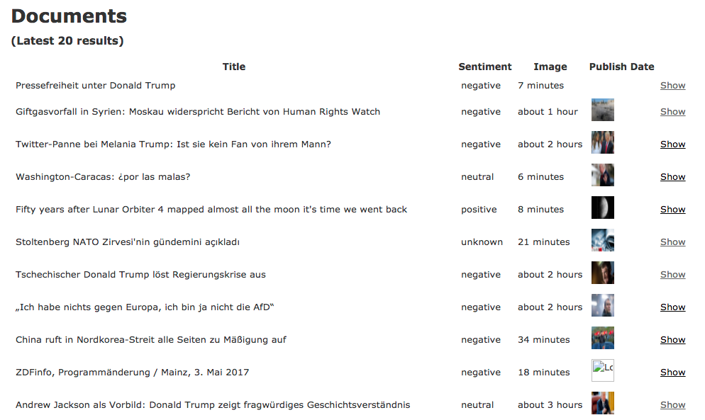

# Deprecation Notice

This project is no longer actively maintained. If you need to create a client library for any of the Meltwater APIs, please refer to the OpenAPI specs of the respective API at developer.meltwater.com. From those OpenAPI specs you can generate the client yourself.

# Streaming Relational Database

*Streaming Relational Database* is a sample [Rails 5.0.x][rails-5.0.x] app which can be used to receive search results from the [Meltwater Streaming API][meltwater-api-docs] and store these results in a relational database. Once data from the Meltwater Streaming API is stored it can be integrated as part of your application, for example, as part of a product dashboard.

The selected database used in this sample project is [Microsoft SQL Server][mssql-server-official], however it can easily be adapted to work with most major relational databases such as [PostgreSQL][postgre-sql] or [MySQL][my-sql].

## Prerequisites

The sample application has been created using Docker to setup and run the web server and database. To get up and running with Docker you'll need the following:

- [Docker][docker-official] - find the toolkit for your platform at [Get Docker][get-docker]
- [docker-compose][docker-compose-official] _Note: Depending on your docker setup, `docker-compose` might already be included._
- [ngrok][ngrok] - will be used to make the local application accessible to the Meltwater API.

_NOTE: The [Microsoft SQL Server Docker Image][mssql-server-official-docker] requires a significant amount of RAM. Make sure you allocate at least 4 GB of RAM to Docker before starting._

## Getting Started

### Initial startup

The very first time you start `docker-compose up` the Rails app might exit after a short time. The is because you will need to first run the database creation and migration tasks:

1. On initial run:

```shell
$ docker-compose up
```

Rails app will exit on first time. Simply press CTRL-C to stop docker-compose.

2. Run migration tasks:

```shell
$ docker-compose run web rake db:create
$ docker-compose run web rake db:migrate
```

3. Re-run `docker-compose`:

```shell
$ docker-compose up
```

Now you should be able to open [http://localhost:3000][rails-local].

### Running the application

1. Run `docker-compose` _(if your application is not already running)_:

```shell
$ docker-compose up
```

2. Open [http://localhost:3000][rails-local] in your browser. This should greet you with the default Rails welcome page.



3. Run a sample `POST` request with the provided [sample/sample-payload.json][sample-payload]:

```shell
$ curl -XPOST http://localhost:3000/webhooks -H 'Content-Type: application/json' -d @./sample/sample-payload.json
```

You should now have a new search result in your database. To inspect your data, use an appropriate Microsoft SQL Server client, e.g. [sqlcmd][sqlcmd].

If your application is running you can view your documents at [http://localhost:3000/documents][localhost-documents-list].



### Setting the application up with real data

Once the application is up and running you can use a tool such as [ngrok][ngrok] to make the `http://localhost:3000/webhooks` endpoint accessible to the Meltwater API.

1. Use ngrok to expose your local application:

```shell
$ ngrok http 3000
```

2. Once ngrok is up and running it will give you a unique public URL to access the application you have running at [localhost:3000][rails-local].

You should see something like this (where `92832de0` will be unique to your instance):

```shell
ngrok by @inconshreveable

Tunnel Status                 online
Version                       2.0/2.0
Web Interface                 http://127.0.0.1:4040
Forwarding                    http://92832de0.ngrok.io -> localhost:80
Forwarding                    https://92832de0.ngrok.io -> localhost:80
```

Verify that ngrok is setup correctly by visiting your ngrok URL in the browser - you should see the Rails welcome page again.

3. You can then use the ngrok '/webooks' URL (e.g. `https://92832de0.ngrok.io/webhooks`) as the `target_url` when creating an API Hook.

See the [Streaming API - Quick Start][streaming-quick-start] tutorial for details on how to create a Meltwater API hook. (In step #4 you'll use the ngrok public url as the `taget_url`)

4. Once your hook is setup, refresh the page at [localhost:3000/documents][localhost-documents-list] . You should start to see some search results!



If you don't see any results, ensure the search you're using has enough search results to provide a stream of data.

## Using an Alternate Database

The sample application and Docker package is setup to use [Microsoft SQL Server][mssql-server-official], however it can easily be run with other relational databases.

To do this we'll need to run the application locally without the use of docker.

### Prerequisites

- Install the latest version of [ruby][ruby]
- Install [bundler][bundler] `gem install bundler`
- Install the necessary gems - In the root directory of the project run `bundle install`

### Set the Rails database

The project is set up to use the [`activerecord-sqlserver-adapter`][activerecord-sqlserver-adapter], Microsoft SQL Server database adapter. To use a different database, we need to change the database adapter.

- Open up the [Gemfile][gemfile] and replace the `activerecord-sqlserver-adapter` gem with the appropriate adapter. (Remember to run `bundle install`if you install any new libraries.)
- Update the [database.yml][database.yml] file with the appropriate configuration details for your database. You can find an example config file for PostgreSQL and MySQL in the [config][config] folder.

See more details on configuring Rails database connections in the [Rails Guides][rails-connection-preference].

### Run the application

Once the database is up and running

- create the database by running `bundle exec rake db:create`
- migrate the database by running `bundle exec rake db:migrate`
- Run the application by running `bundle exec rails server`
* Open [http://localhost:3000][rails-local] in your browser. This should greet you with the default Rails welcome page.

## Appendix

This repository is using [Microsoft's SQL Server as Linux docker container][mssql-server-linux-docker]. More information can be found [here][mssql-server-linux-docker].

## License

See [LICENSE](LICENSE).

[meltwater-api-docs]: https://developer.meltwater.com/
[rails-5.0.x]: http://guides.rubyonrails.org/5_0_release_notes.html
[postgre-sql]: https://www.postgresql.org/
[my-sql]: https://www.mysql.com
[docker-official]: https://www.docker.com/
[get-docker]: https://www.docker.com/get-docker
[docker-compose-official]: https://docs.docker.com/compose/
[mssql-server-official]: https://www.microsoft.com/en-us/sql-server/
[mssql-server-official-docker]: https://hub.docker.com/r/microsoft/mssql-server-linux/
[sqlcmd]: https://docs.microsoft.com/en-us/sql/linux/sql-server-linux-connect-and-query-sqlcmd
[mssql-server-linux-docker]: https://docs.microsoft.com/en-us/sql/linux/sql-server-linux-setup-docker
[sample-payload]: ./sample/sample-payload.json
[rails-local]: http://localhost:3000
[localhost-documents-list]: http://localhost:3000/documents
[ngrok]: https://ngrok.com/
[streaming-quick-start]: https://developer.meltwater.com/tutorials/streaming-quick-start
[ruby]: https://www.ruby-lang.org/en/
[bundler]: http://bundler.io/
[gemfile]: https://github.com/meltwater/streaming-relational-database/blob/master/Gemfile
[rails-connection-preference]: http://guides.rubyonrails.org/configuring.html#connection-preference
[database.yml]: https://github.com/meltwater/streaming-relational-database/blob/master/config/database.yml
[config]: https://github.com/meltwater/streaming-relational-database/blob/master/config/
[activerecord-sqlserver-adapter]: https://github.com/rails-sqlserver/activerecord-sqlserver-adapter
